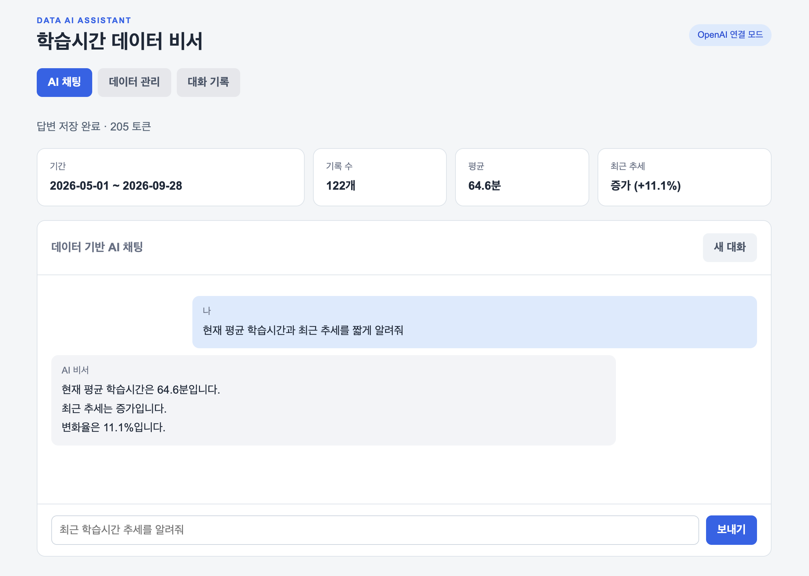
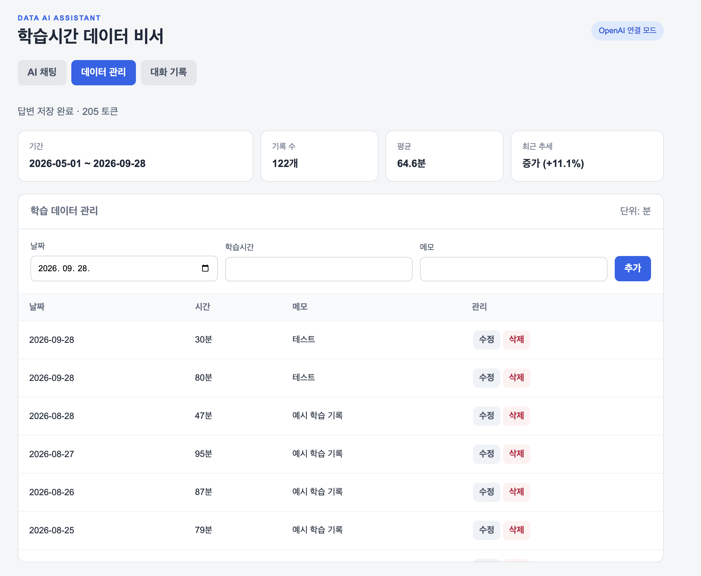
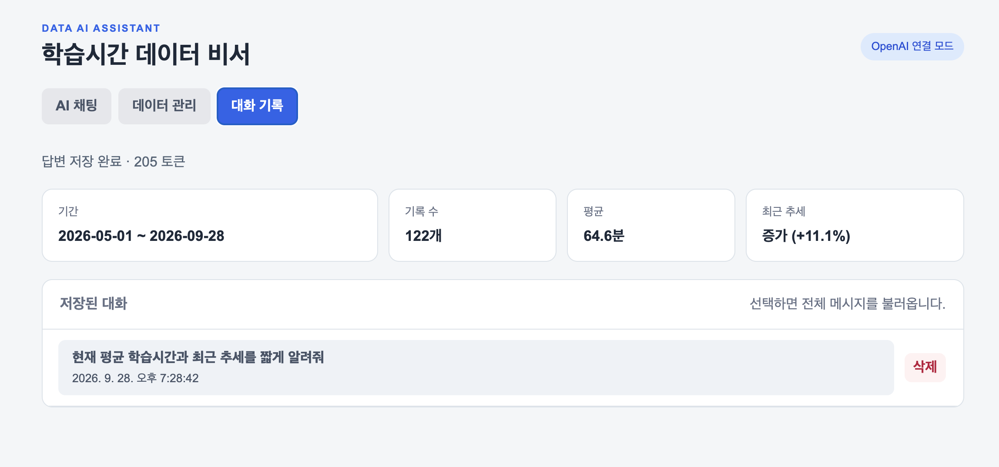
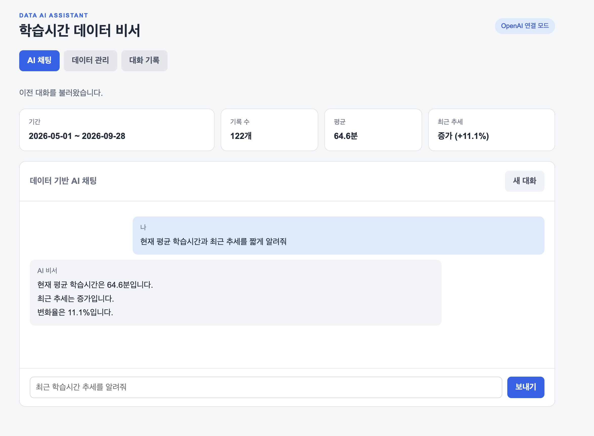
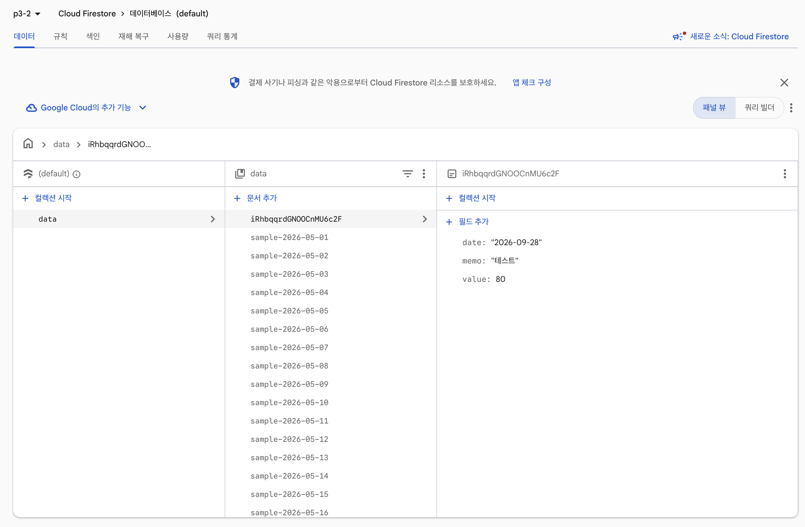
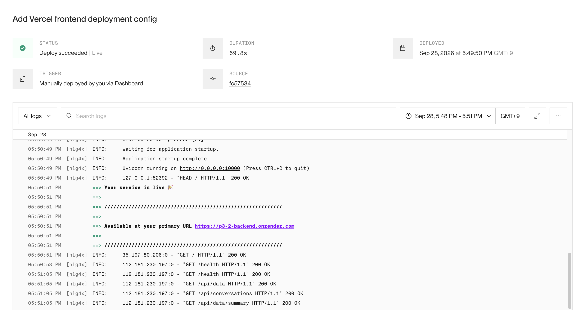
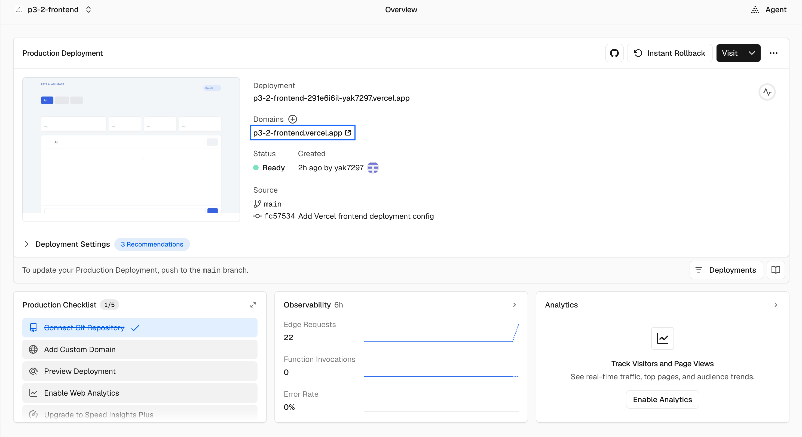
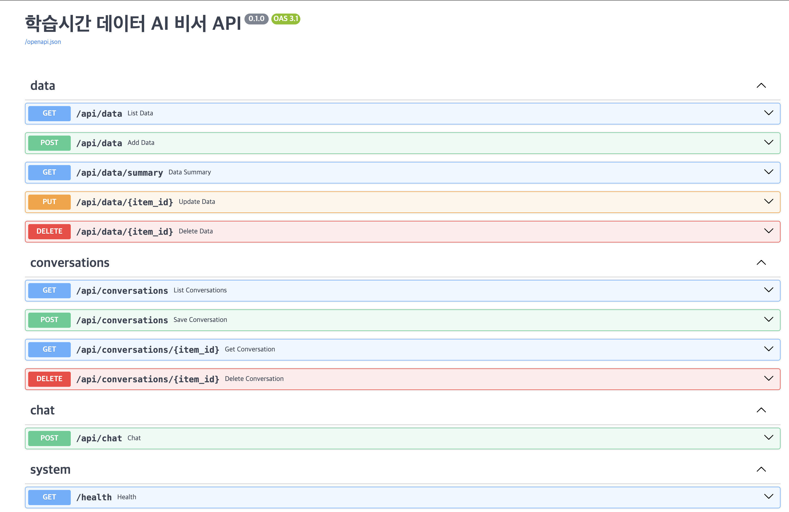

# 학습시간 데이터 AI 비서

학습시간 시계열 데이터를 관리하고, 요약된 통계를 기반으로 AI 질의응답을 제공하는 웹 애플리케이션이다.

## 기술 스택

- 백엔드: Python, FastAPI, Uvicorn, Pydantic
- 데이터베이스: Firebase Cloud Firestore
- AI: OpenAI Python SDK, Codyssey OpenAI 호환 API
- 프론트엔드: HTML, CSS, JavaScript
- 배포: Render, Vercel

## 현재 구현된 기능

- 데이터 CRUD 및 기간/개수/평균/최대/최소/최근 추세 요약
- 대화 자동 저장, 목록 조회, 전체 메시지 불러오기, 삭제
- 요약 정보를 시스템 지침에 넣는 OpenAI 호환 Chat Completions API 채팅
- 개발 중 토큰을 전혀 사용하지 않는 `AI_MODE=mock`
- 로컬 JSON 저장과 Firestore 저장 모드
- FastAPI Swagger UI와 바닐라 HTML/CSS/JavaScript 화면

## 아키텍처와 파일별 책임

프론트엔드와 백엔드를 분리해 화면, API 처리, 분석 로직, 저장소의 책임을 구분했다.

| 위치 | 책임 |
|---|---|
| `frontend/index.html`, `styles.css` | 화면 구조와 반응형 레이아웃 |
| `frontend/app.js` | 화면 상태, API 요청, CRUD 및 대화 불러오기 |
| `backend/main.py` | FastAPI 앱 초기화, CORS, 라우터와 정적 파일 연결 |
| `backend/app/routes.py` | HTTP 엔드포인트, 요청 흐름, 상태 코드와 대화 저장 시점 |
| `backend/app/models.py` | Pydantic 요청 스키마와 입력 검증 |
| `backend/app/services.py` | 데이터 요약과 AI 요청 구성 |
| `backend/app/storage.py` | 로컬 JSON/Firestore 저장소 구현과 선택 |
| `backend/app/config.py` | `.env` 및 실행 환경변수 읽기 |

화면은 `초기화 → /health 확인 → 데이터·대화 목록 조회 → 사용자 요청 → FastAPI 검증 → 서비스 처리 → Firestore 저장 → 화면 갱신` 순서로 동작한다. 오류가 발생하면 API의 `detail` 메시지를 화면 상단에 표시하고, AI 요청 중에는 중복 전송을 차단한다.

## Firestore 컬렉션 설계

문서 ID는 Firestore에서 자동 생성한다. 컬렉션 전체를 조회한 뒤 애플리케이션에서 정렬하는 구조이므로 현재 범위에서는 별도의 복합 색인을 사용하지 않는다.

### `data` 컬렉션

```json
{
  "date": "2026-09-28",
  "value": 80,
  "memo": "테스트"
}
```

- `date`: 학습 날짜(`YYYY-MM-DD`)
- `value`: 하루의 학습시간(분), 0~1440
- `memo`: 선택 메모, 최대 300자

데이터 관리 화면에서 추가한 기록은 이 컬렉션에 저장되며 `/api/data/summary`와 이후 AI 답변에 반영된다.

### `conversations` 컬렉션

```json
{
  "title": "현재 평균 학습시간과 최근 추세를 알려줘",
  "messages": [
    {"role": "user", "content": "현재 평균 학습시간을 알려줘"},
    {"role": "assistant", "content": "현재 평균 학습시간은 64.6분입니다."}
  ],
  "updated_at": "2026-09-28T10:28:42+00:00"
}
```

- AI 답변 생성이 성공한 직후 사용자 메시지와 답변을 함께 저장한다.
- 기존 `conversation_id`가 있으면 해당 문서를 갱신하고, 없으면 새 문서를 생성한다.
- 목록 API에서는 `messages`를 제외하고, 항목 선택 시 전체 대화를 별도로 조회한다.

## 토큰 절약 원칙

- 120개 원본 데이터와 메모는 GPT에 보내지 않고 작은 요약 JSON만 전송
- 최근 메시지 4개만 전송하고 각 메시지를 500자로 제한
- 질문을 500자로 제한하고 출력은 기본 220토큰으로 제한
- 개발과 화면 확인은 mock 모드로 진행하고 마지막 실제 확인만 OpenAI 모드 사용

## AI 컨텍스트 주입 방식

`backend/app/services.py`의 `answer()`는 고정된 시스템 지침에 `_compact_summary()` 결과를 JSON으로 포함한다. 원본 학습 기록과 메모는 전송하지 않으며, 대화 문맥은 최근 메시지 4개를 각각 500자로 제한해 전달한다.

- 기대효과: 실제 요약 수치에 근거한 답변 생성, 토큰 비용 절감, 개인정보 노출 범위 축소
- 유효범위: 기간, 개수, 합계·평균·최대·최소, 최고 학습일, 최근 추세 등 요약에 포함된 정보
- 한계: 요약에서 제외된 특정 날짜의 상세 기록이나 원인은 판단할 수 없으며, 없는 정보는 알 수 없다고 응답하도록 설정
- 안전성: API 키는 백엔드에만 저장하고 사용자 메모 원문은 AI에 전송하지 않으며, 질문과 대화 길이를 제한

## 요약 기준과 변경 방법

요약 계산은 `backend/app/services.py`의 `summarize(rows)`가 담당한다. 현재 기준은 다음과 같다.

1. 같은 날짜의 여러 기록을 일별 합계로 집계한다.
2. 최근 7개 기록일 평균과 직전 7개 기록일 평균을 비교한다.
3. 변화율이 `5% 초과`이면 증가, `-5% 미만`이면 감소, 그 사이는 유지로 분류한다.
4. 기록일이 14개 미만이면 추세 판단을 보류한다.

기간과 임계값은 `summarize()` 내부의 `14`, `7`, `5` 기준으로 관리한다. 기간 필터가 필요한 경우 `backend/app/routes.py`의 `data_summary()`에서 날짜 조건을 적용한 뒤 `summarize()`에 전달할 수 있다. 요약 결과는 DB에 저장하지 않고 API 및 채팅 요청 시 다시 계산하므로 기준 변경 후 테스트와 재배포만으로 기존 데이터에 새 기준이 적용된다.

요약 로직을 교체할 때는 `summarize()`와 AI용 `_compact_summary()`를 함께 변경해 API·화면·AI의 기준을 일치시킨다.

## 로컬 실행

Python 3.10 이상 환경에서 다음 명령으로 실행할 수 있다.

```bash
cd backend
python3 -m venv .venv
source .venv/bin/activate
pip install -r requirements-dev.txt
cp .env.example .env
python seed.py
uvicorn main:app --reload
```

- 앱: http://127.0.0.1:8000
- Swagger: http://127.0.0.1:8000/docs
- 테스트: `pytest -q`

## 주요 API 사용 예시

모든 JSON 응답은 `backend/app/models.py`의 Pydantic 응답 모델로 검증되며 Swagger에 스키마가 표시된다. 주요 모델은 `DataRecord`, `DataSummary`, `ConversationListItem`, `ConversationRecord`, `ChatResponse`, `HealthResponse`이다. 서버 코드가 명세와 다른 형태를 반환하면 FastAPI의 응답 검증 단계에서 오류가 발생한다.

학습 기록 추가:

```bash
curl -X POST http://127.0.0.1:8000/api/data \
  -H "Content-Type: application/json" \
  -d '{"date":"2026-09-28","value":80,"memo":"FastAPI 공부"}'
```

`GET /api/data/summary` 응답 예시:

```json
{
  "period": "2026-05-01 ~ 2026-09-28",
  "count": 122,
  "unit": "분",
  "metrics": {"total": 7886, "average": 64.6, "max": 95, "min": 30},
  "best_day": {"date": "2026-09-28", "value": 110},
  "trend": "증가",
  "change_percent": 11.1,
  "trend_basis": "최근 7개 기록일과 직전 7개 기록일의 일별 합계 평균 비교"
}
```

요청 검증에 실패하면 FastAPI가 `422`를 반환한다. `value`가 1440을 초과하거나 날짜 형식이 잘못된 경우, 또는 정의되지 않은 필드가 포함된 경우가 이에 해당한다.

## 입력 검증과 보안

- 정의되지 않은 필드 금지 및 문자열 양끝 공백 제거
- 학습시간 0~1440분, 메모 300자, 질문 500자, 메시지 3000자 제한
- 문서 ID를 영문자·숫자·밑줄·하이픈으로 제한하고 최대 길이를 128자로 설정
- 역할 값을 `user` 또는 `assistant`로 제한하고 대화당 메시지를 최대 50개로 설정
- 사용자·AI 문자열을 `innerHTML`이 아닌 `textContent`로 출력해 스크립트 실행 방지
- 단어 블랙리스트 대신 구조·길이·역할 검증과 AI 시스템 지침을 통한 범위 제한

## OpenAI 연동 설정

OpenAI 연동에는 다음 환경변수를 사용한다.

```dotenv
AI_MODE=openai
OPENAI_API_KEY=API_KEY_VALUE
OPENAI_BASE_URL=https://copa.codyssey.kr/v1
OPENAI_MODEL=gpt-5.4-mini
```

OpenAI Python SDK는 환경변수의 키와 Codyssey 호환 주소를 읽어 Chat Completions API를 호출한다. 실제 API 키는 저장소에 포함하지 않는다.

## Firestore 연동 설정

Firestore 모드는 다음 환경변수로 활성화한다.

```dotenv
STORAGE_BACKEND=firestore
FIREBASE_SERVICE_ACCOUNT_JSON={서비스 계정 JSON 전체}
```

로컬 환경에서는 `GOOGLE_APPLICATION_CREDENTIALS=/절대/경로/service-account.json` 방식도 지원한다.

## 배포 주소

- GitHub: [https://github.com/yak7297/p3-2](https://github.com/yak7297/p3-2)
- 프론트엔드: [https://p3-2-frontend.vercel.app](https://p3-2-frontend.vercel.app)
- 백엔드 API: [https://p3-2-backend.onrender.com](https://p3-2-backend.onrender.com)
- Swagger UI: [https://p3-2-backend.onrender.com/docs](https://p3-2-backend.onrender.com/docs)

Render 무료 인스턴스는 일정 시간 요청이 없으면 정지되며, 이후 첫 요청에 약 50초 이상의 콜드스타트가 발생할 수 있다. 운영 정책과 요금제가 허용되는 환경에서는 `/health` 주기 호출 방식의 프리워밍을 고려할 수 있다.

## 환경 변수

백엔드의 최소 환경변수 구성은 다음과 같다. 실제 키와 서비스 계정 JSON은 저장소에 포함하지 않는다.

```dotenv
STORAGE_BACKEND=firestore
AI_MODE=openai
OPENAI_API_KEY=API_KEY_VALUE
OPENAI_BASE_URL=https://copa.codyssey.kr/v1
OPENAI_MODEL=gpt-5.4-mini
MAX_OUTPUT_TOKENS=220
FIREBASE_SERVICE_ACCOUNT_JSON={서비스 계정 JSON 전체}
ALLOWED_ORIGINS=https://p3-2-frontend.vercel.app
```

Render 또는 셸에 등록된 실행 환경변수는 `backend/.env`보다 우선한다. Firebase 인증은 `FIREBASE_SERVICE_ACCOUNT_JSON`을 우선 사용하며, 값이 없으면 Application Default Credentials를 사용한다. `GOOGLE_APPLICATION_CREDENTIALS`는 로컬 인증 파일의 위치를 지정한다.

`ALLOWED_ORIGINS`에는 허용할 프론트엔드 주소만 쉼표로 구분해 등록한다. 운영 환경에서는 `*`를 사용하지 않는다.

## Vercel 환경 변수

Vercel 프로젝트는 Root Directory를 `frontend`로 지정하고 다음 환경변수를 사용한다.

```dotenv
API_BASE_URL=https://p3-2-backend.onrender.com
```

빌드 과정에서 해당 값으로 `dist/config.js`를 생성한다. 브라우저 코드에는 API 키와 Firebase 서비스 계정 키가 포함되지 않는다.

## 제출 스크린샷

다음 화면은 필수 기능과 실제 배포 상태를 보여준다. API 키와 Firebase 서비스 계정 값은 포함하지 않았다.

### 데이터 요약 기반 AI 채팅



### 데이터 관리 CRUD



### 저장된 대화 목록



### 대화 기록 불러오기



### Firestore 데이터베이스 생성



### Render 백엔드 배포 성공



### Vercel 프론트엔드 배포 성공



### FastAPI Swagger API 문서


